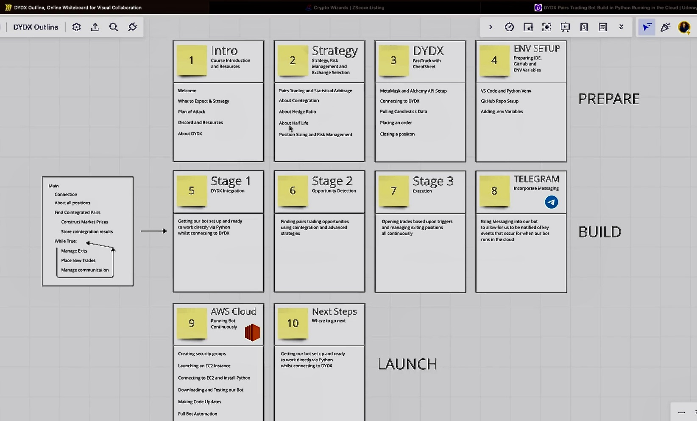
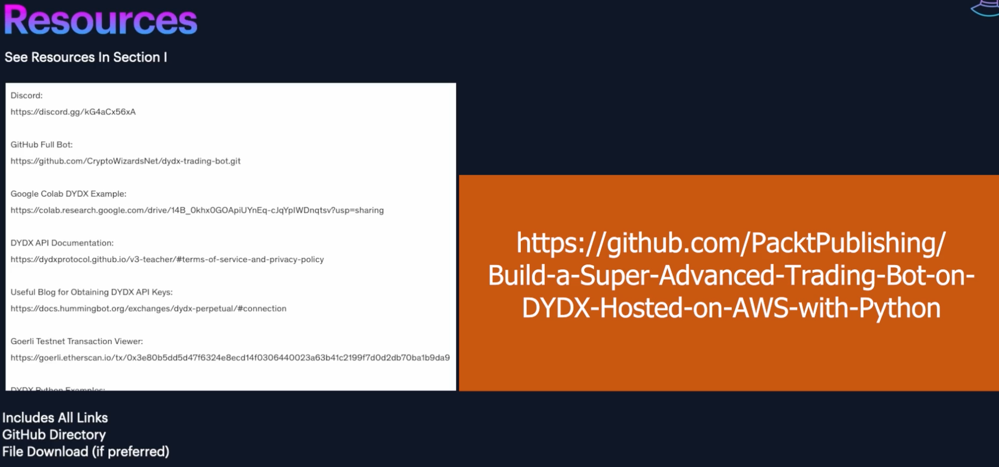
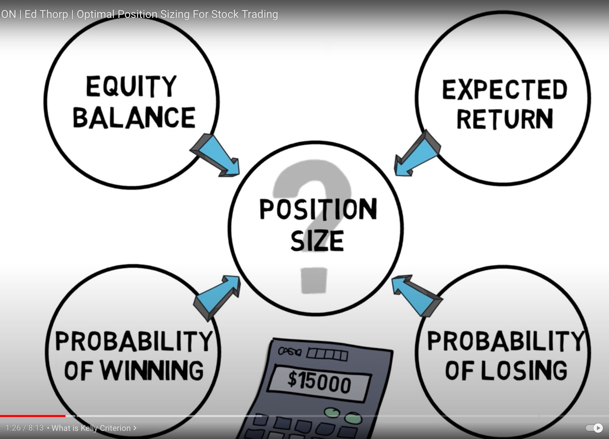
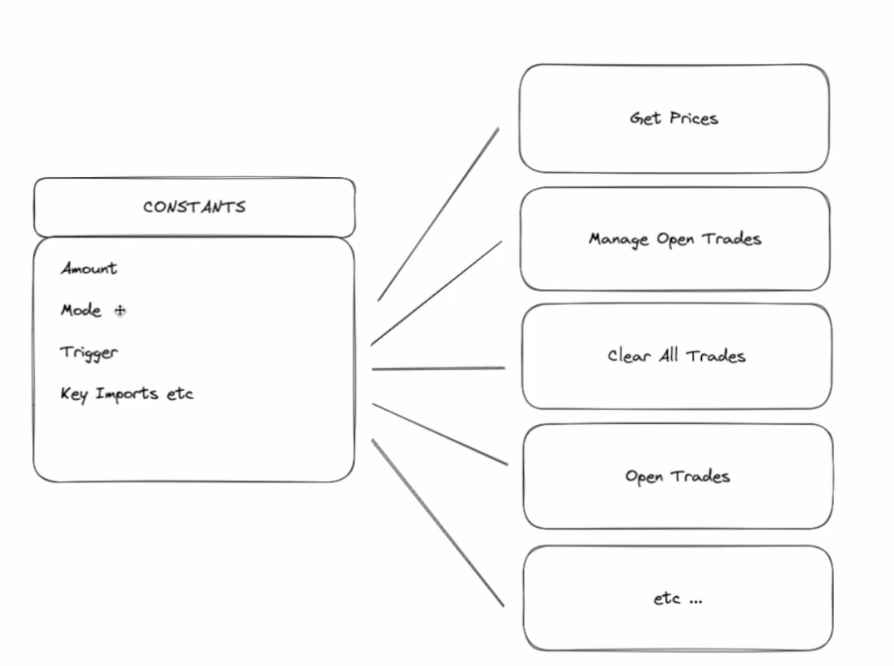
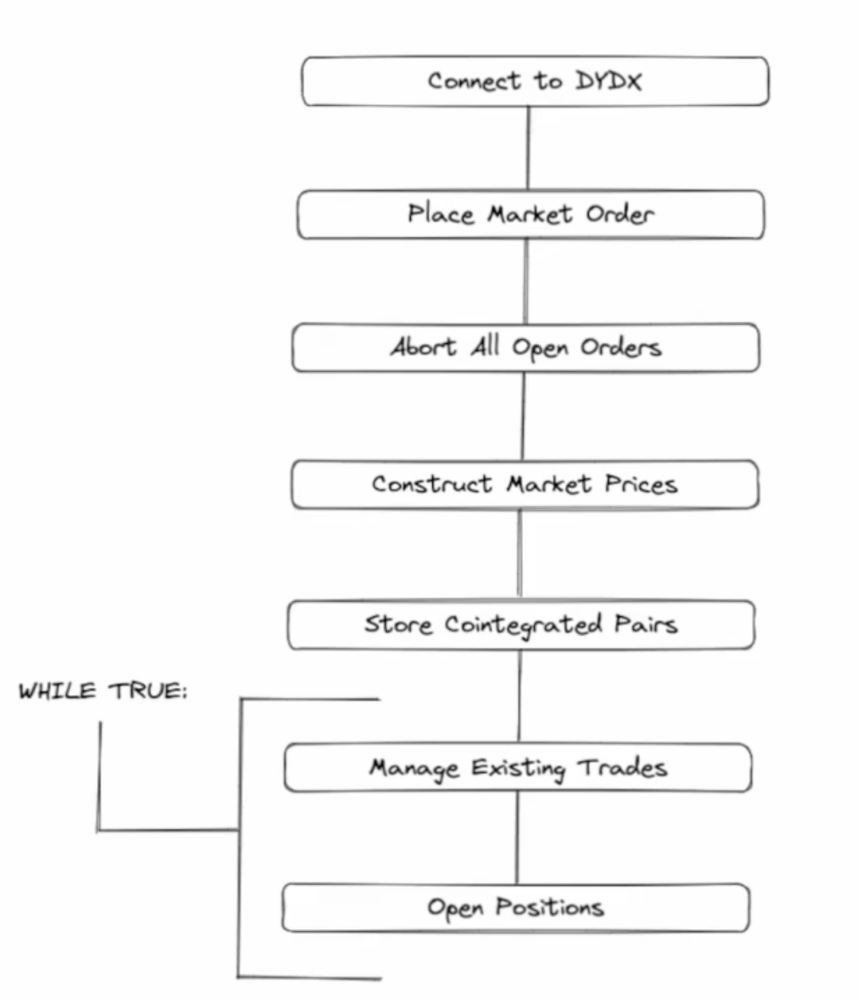
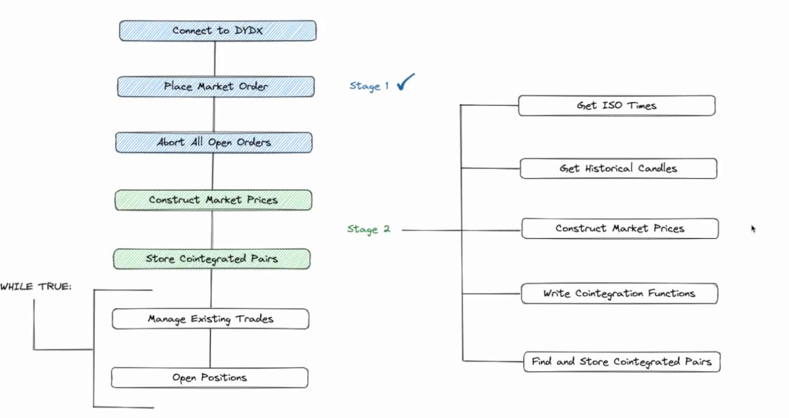
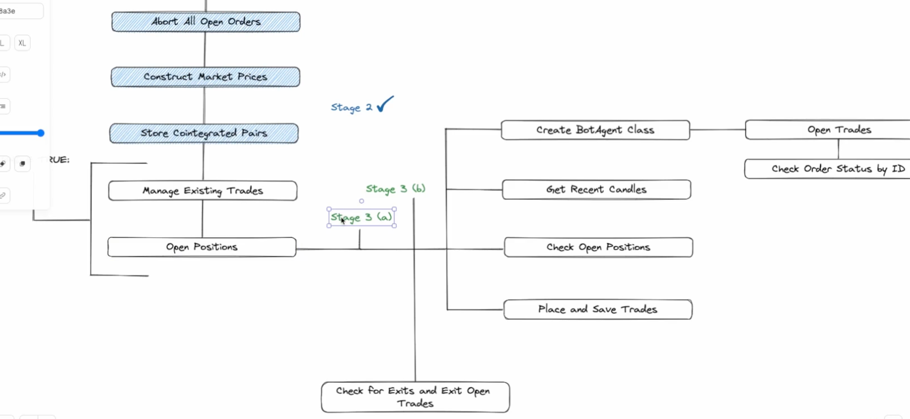
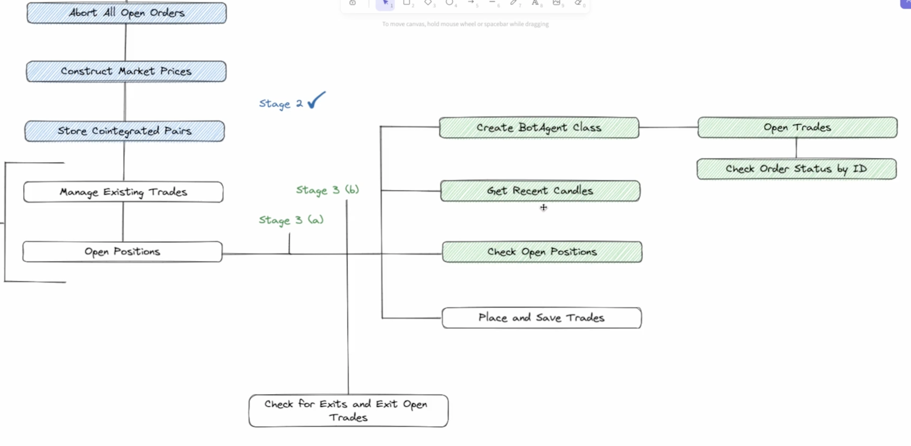

# [10_DYDX_Bot](https://dydxprotocol.github.io/v3-teacher/#public-http-api)
 Learn how to develop a super advanced trading bot on DYDX hosted on AWS using Python.

 https://www.udemy.com/user/shaun34/
 
 https://cryptowizards.net
 
 https://www.udemy.com/course/dydx-pairs-trading-bot-build-in-python-running-in-the-cloud/#instructor-1

# What not to expect

Getting rich quick SCHEME !!!

## Planning

## Resources

* https://github.com/PacktPublishing/Build-a-Super-Advanced-Trading-Bot-on-DYDX-Hosted-on-AWS-with-Python

## Kelly Criterion: Position size is not defined, it should be an output

## Trading is a casino: look for no fees, 0.01% is the difference between doubling or loosing ALL

* At least 54% EDGE

* If you don't know your REAL WIN RATE or OPTIMAL POSITION SIZE USE 1%

## Constants

ALL THE CONSTANTS

## Bot structure

## Planning Stage 2

### Stage 3
---
Stage 3-A:

* Create a Bot Agent Class: because we will open many positions, it makes sense to create a class

    * Open Trades.

    * Check Validity and Success of those trades.

    * Decision Factor?: get recent candles, check open positions, place and save trades.

Stage 3-B:

* Check for Exits and Open trades

